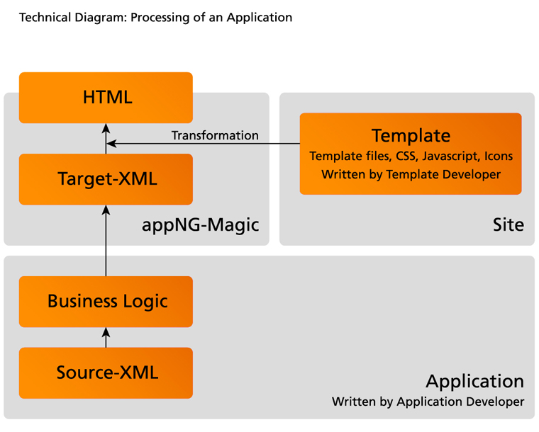

= appNG Application Developer Guide
Matthias Müller <matthias.mueller@appng.org>; Claus Stümke <claus.stuemke@appng.org>; Matthias Herlitzius <matthias.herlitzius@appng.org>;
Version {project-version} created on {localdate}

:title-logo-image: images/appng.png
:toc:
:homepage: http://appng.org

:appng: https://appng.org/appng/docs/{project-version}/javadoc
:lucene: http://lucene.apache.org/core/8_5_0/core/index.html
:spring: https://docs.spring.io/spring/docs/{spring-version}
:spring-data: https://docs.spring.io/spring-data/commons/docs/{spring-data-version}
:spring-data-jpa: https://docs.spring.io/spring-data/jpa/docs/{spring-data-jpa-version}
:jse: https://docs.oracle.com/javase/8/docs/api
:jee: https://docs.oracle.com/javaee/7/api
:appng-schema: http://www.appng.org/schema

== Scope
This document describes how to develop applications based on the appNG platform.

== Core concepts
An appNG application relies on three core concepts: XML, Java and templating. The basic idea is that you define the *structure* of your user interface in XML and implement the *business logic* in Java. Finally, the templating engine transforms the internal XML-based structure into an HTML-based user interface.

The following diagram illustrates these core concepts:

Below a short explanation of the diagram's elements:

* *Source-XML* +
The XML files defining the structure of the user interface. +
The following XML schema is used for the source-XML: +
{appng-schema}/platform/appng-platform.xsd[^]
* *Business Logic* +
The implementation of the business logic in Java.
* *Template* +
An appNG template is a set of resources, used to transform the target-XML into HTML. The supported template technologies are https://en.wikipedia.org/wiki/XSLT[XSLT^] and https://www.thymeleaf.org/[Thymeleaf^]. +
A template consists of several template files consumed by the template engine and all the assets (like JavaScript, CSS, icons) needed to render the HTML. It also contains a `platform.xml` file which is the blue-print for the generated target-XML.
* *Target-XML* +
The target-XML is one single XML document using the template's `platform.xml` as a blue print. This XML document is being enriched with XML fragments that result from combining the static source-XML with the dynamic business logic.
* *HTML* +
The resulting HTML that is delivered to the user's browser.

include::parts/structure.adoc[]

include::parts/application.adoc[]

include::parts/datasources.adoc[]

include::parts/actions.adoc[]

include::parts/pages.adoc[]

include::parts/common.adoc[]

include::parts/jsp.adoc[]

include::parts/searching.adoc[]

include::parts/testing.adoc[]

include::parts/api.adoc[]

include::parts/urlrewriting.adoc[]

include::parts/maven.adoc[]

include::parts/camunda.adoc[]

include::parts/appendix.adoc[]